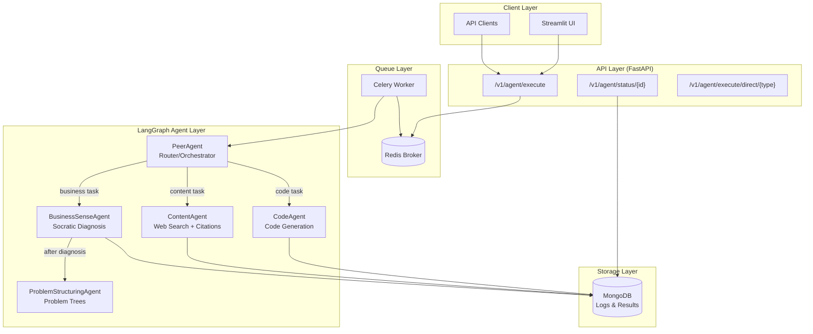
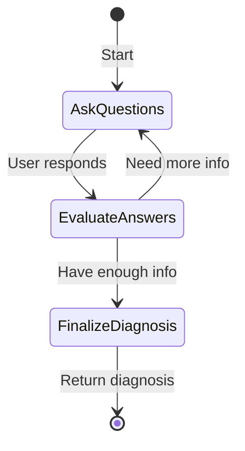

# 🤖 PeerAgent - Multi-Agent AI System

[](https://github.com/your-repo/peeragent/actions)
[](https://www.python.org/downloads/)
[](https://fastapi.tiangolo.com)
[](https://github.com/langchain-ai/langgraph)

A sophisticated multi-agent system built with **LangGraph** for intelligent task routing and execution. Features a FastAPI backend, Celery queue processing, MongoDB logging, and Streamlit UI.

---

## 📋 Table of Contents

- [Architecture](#-architecture)
- [Features](#-features)
- [Quick Start](#-quick-start)
- [API Reference](#-api-reference)
- [Agent Details](#-agent-details)
- [Configuration](#-configuration)
- [Development](#-development)
- [Testing](#-testing)
- [Deployment](#-deployment)
- [Design Decisions](#-design-decisions)

---

## 🏗 Architecture



### Data Flow

1. **Request** → Client sends task to FastAPI
2. **Classification** → PeerAgent classifies task (keyword + LLM)
3. **Routing** → Task routed to appropriate sub-agent
4. **Execution** → Agent processes task with LLM
5. **Logging** → All interactions logged to MongoDB
6. **Response** → Result returned to client

---

## ✨ Features

| Feature | Description |
|---------|-------------|
| 🧠 **Intelligent Routing** | PeerAgent automatically classifies and routes tasks |
| 💻 **Code Generation** | Generate clean, documented code with explanations |
| 📚 **Web Research** | Search the web with DuckDuckGo and cite sources |
| 📈 **Business Analysis** | Socratic questioning for problem diagnosis |
| 🌳 **Problem Trees** | Structured MECE problem analysis |
| 📝 **Full Logging** | All agent interactions logged to MongoDB |
| ⚡ **Async Queue** | Celery + Redis for background processing |
| 🎨 **Modern UI** | Streamlit chat interface |
| 🐳 **Docker Ready** | Full Docker Compose setup |
| 🔄 **CI/CD** | GitHub Actions pipeline |

---

## 🚀 Quick Start

### Prerequisites

- Python 3.11+
- Docker & Docker Compose (for containerized setup)
- OpenAI API Key (or other LLM provider)

### Option 1: Docker Compose (Recommended)

```bash
# Clone the repository
git clone https://github.com/your-repo/peeragent.git
cd peeragent

# Create .env file
cp .env.example .env
# Edit .env and add your OPENAI_API_KEY

# Start all services
docker-compose up --build

# Access:
# - API: http://localhost:8000
# - API Docs: http://localhost:8000/docs
# - UI: http://localhost:8501
```

### Option 2: Local Development

```bash
# Create virtual environment
python -m venv .venv
.\.venv\Scripts\activate  # Windows
# source .venv/bin/activate  # Linux/Mac

# Install dependencies
pip install -r requirements.txt

# Set environment variables
cp .env.example .env
# Edit .env with your API keys

# Start MongoDB and Redis (required)
docker-compose up -d mongo redis

# Run the API
uvicorn src.api.main:app --reload

# (Optional) Run Celery worker in another terminal
celery -A src.worker.celery_app worker --loglevel=info

# (Optional) Run Streamlit UI in another terminal
streamlit run ui/streamlit_app.py
```

---

## 📡 API Reference

### Execute Task

```http
POST /v1/agent/execute
Content-Type: application/json

{
  "task": "Write a Python function to read a CSV file",
  "session_id": "optional-session-id"
}
```

**Response:**
```json
{
  "task_id": "task-abc123",
  "status": "completed",
  "message": "Task executed successfully"
}
```

### Get Task Status

```http
GET /v1/agent/status/{task_id}
```

**Response:**
```json
{
  "task_id": "task-abc123",
  "status": "completed",
  "result": {
    "agent_type": "code_agent",
    "data": {
      "code": "def read_csv(path)...",
      "language": "python",
      "explanation": "This function..."
    }
  }
}
```

### Direct Agent Execution

```http
POST /v1/agent/execute/direct/{agent_type}
```

Agent types: `code`, `content`, `business`

### Classify Task (Debug)

```http
GET /v1/agent/classify?task=Write%20Python%20code
```

---

## 🤖 Agent Details

### PeerAgent (Router)

The master orchestrator that routes tasks to sub-agents.

**Classification Strategy:**
1. **Keyword Matching** (Fast) - Checks for domain-specific keywords
2. **LLM Classification** (Fallback) - Uses LLM for ambiguous cases

### CodeAgent

Generates code with explanations.

**Output Schema:**
```json
{
  "code": "def example()...",
  "language": "python",
  "explanation": "This function..."
}
```

### ContentAgent

Web research with DuckDuckGo and source citations.

**Output Schema:**
```json
{
  "content": "Machine learning is...",
  "sources": ["https://...", "https://..."]
}
```

### BusinessSenseAgent

**Socratic questioning** approach using LangGraph StateGraph:



**Questioning Phases:**
1. **Problem Identification** - When did it start? What's the impact?
2. **Scope Clarification** - Who is affected? What if nothing changes?
3. **Root Cause Discovery** - Need solution or visibility first?

**Output Schema (BusinessDiagnosis):**
```json
{
  "customer_stated_problem": "Sales are dropping",
  "identified_business_problem": "Market share erosion",
  "hidden_root_risk": "Brand perception degradation",
  "urgency_level": "Critical"
}
```

### ProblemStructuringAgent

Creates structured **Problem Trees** (Issue Trees).

**Output Schema (ProblemTree):**
```json
{
  "problem_type": "Growth",
  "main_problem": "Declining Sales",
  "root_causes": [
    {
      "cause": "Marketing Inefficiency",
      "sub_causes": ["Wrong targeting", "Low conversion"]
    }
  ]
}
```

---

## ⚙️ Configuration

### Environment Variables

| Variable | Description | Default |
|----------|-------------|---------|
| `LLM_PROVIDER` | LLM provider (openai, anthropic, google) | `openai` |
| `OPENAI_API_KEY` | OpenAI API key | Required |
| `LLM_MODEL` | Model name | `gpt-4` |
| `MONGODB_URL` | MongoDB connection string | `mongodb://localhost:27017` |
| `REDIS_URL` | Redis connection string | `redis://localhost:6379/0` |

### Supported LLM Providers

- **OpenAI**: GPT-4, GPT-3.5-Turbo
- **Anthropic**: Claude-3, Claude-2
- **Google**: Gemini Pro

---

## 🧪 Testing

```bash
# Run all tests
pytest tests/ -v

# Run unit tests only
pytest tests/unit/ -v

# Run integration tests
pytest tests/integration/ -v

# Run with coverage
pytest tests/ --cov=src --cov-report=html
```

### Test Coverage

- **Unit Tests**: Router classification, agent initialization
- **Integration Tests**: API endpoints, error handling

### Expanding Test Coverage

Future test improvements:
- Mock LLM responses for deterministic testing
- End-to-end tests with test containers
- Performance benchmarks
- Load testing with Locust

---

## 🚢 Deployment

### Docker Compose Production

```bash
docker-compose -f docker-compose.yml up -d
```

### GitHub Actions CI/CD

The pipeline includes:
1. **Lint** - flake8 and mypy
2. **Test** - pytest with Redis/Mongo services
3. **Build** - Docker images pushed to GHCR
4. **Deploy** - Customizable deployment step

### AWS CodeDeploy

Includes `appspec.yml` and deployment scripts for AWS.

---

## 🎯 Design Decisions

### Why LangGraph?

LangGraph provides:
- **Stateful workflows** - Essential for multi-turn BusinessSenseAgent
- **Conditional routing** - Dynamic agent selection
- **Built-in persistence** - Can checkpoint conversation state
- **Visualization** - Debug complex agent flows

### Why Celery + Redis?

- **Async processing** - Don't block API on slow LLM calls
- **Horizontal scaling** - Add more workers as needed
- **Reliability** - Task retry on failure
- **Visibility** - Monitor queues with Flower

### Prompt Engineering

**Best Practices Applied:**
1. **Role definition** - Clear agent personas
2. **Structured output** - Pydantic schemas with format instructions
3. **Few-shot examples** - Example outputs in prompts
4. **Chain-of-thought** - BusinessAgent asks questions first
5. **Guardrails** - Output validation via Pydantic

### Logging Strategy

MongoDB was chosen for:
- **Schema flexibility** - Store varied agent outputs
- **Query capability** - Filter by agent type, session
- **JSON-native** - Natural fit for LLM responses

---

## 📄 Production Recommendations

### Security
- [ ] Implement rate limiting (FastAPI middleware)
- [ ] Add API key authentication
- [ ] Sanitize user inputs
- [ ] Use secrets management (AWS Secrets Manager, Vault)

### Scalability
- [ ] Kubernetes deployment
- [ ] Horizontal Pod Autoscaler for workers
- [ ] Redis Cluster for high availability
- [ ] MongoDB replica set

### Monitoring
- [ ] Prometheus metrics
- [ ] Grafana dashboards
- [ ] Celery Flower for queue monitoring
- [ ] LangSmith for LLM observability

### Cost Optimization
- [ ] Token usage tracking
- [ ] Model routing (cheaper models for simple tasks)
- [ ] Response caching

---

## 📝 License

MIT License - see [LICENSE](LICENSE) for details.

---

## 🙏 Acknowledgements

- [LangChain](https://langchain.com) - LLM framework
- [LangGraph](https://github.com/langchain-ai/langgraph) - Stateful agent orchestration
- [FastAPI](https://fastapi.tiangolo.com) - Modern Python API framework
- [Streamlit](https://streamlit.io) - Rapid UI development
