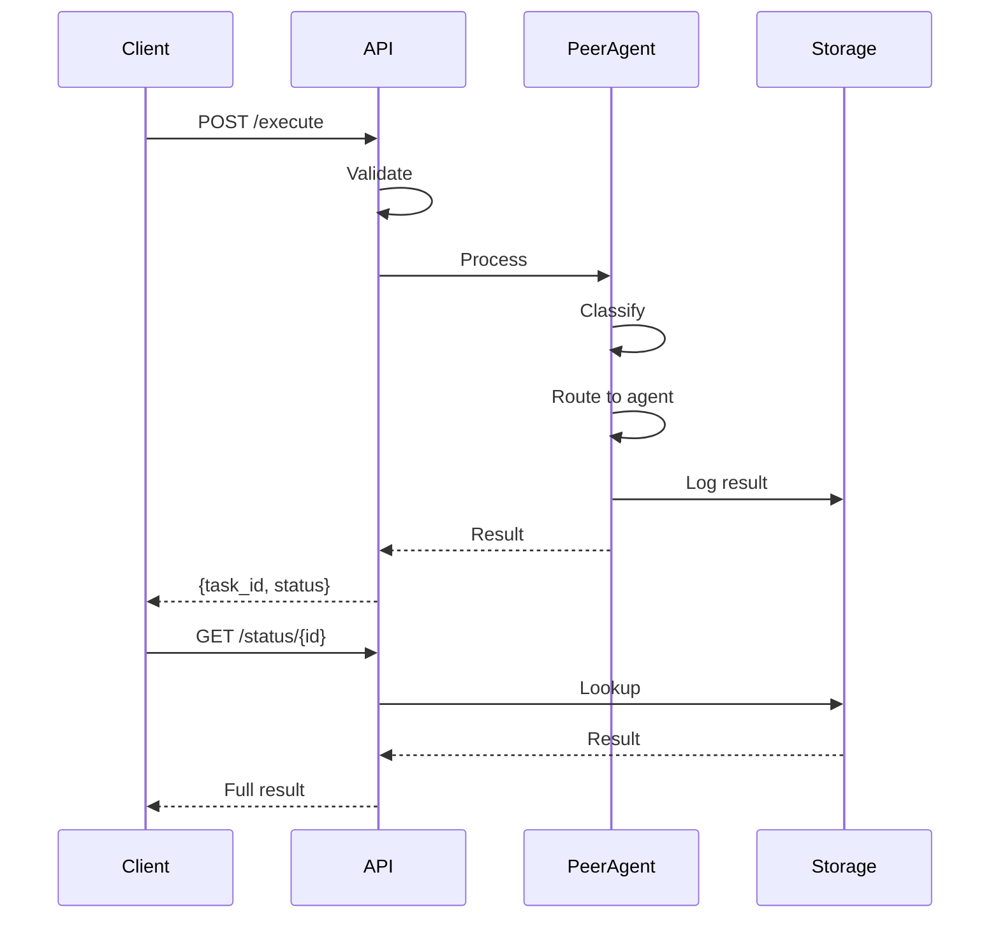
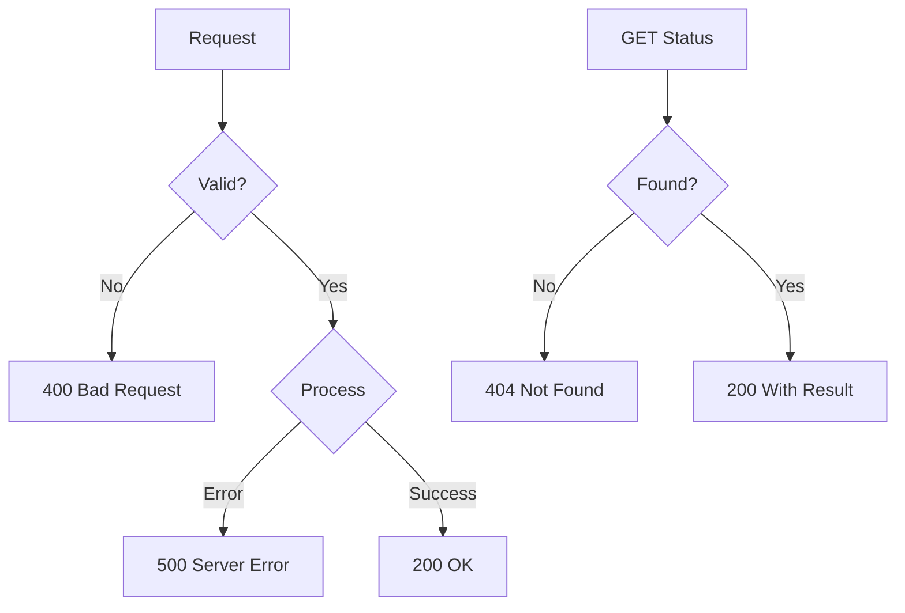

# API Navigation Guide

Complete guide to navigating and using the PeerAgent API.

## Base URL

- **Local Development**: `http://localhost:8000`
- **Docker**: `http://localhost:8000`

---

## Quick Start Flow


---

## Endpoints

### 1. Root & Health

| Method | Endpoint | Description |
|--------|----------|-------------|
| GET | `/` | API information |
| GET | `/health` | Health check |
| GET | `/docs` | Swagger UI |
| GET | `/redoc` | ReDoc documentation |

### 2. Agent Endpoints

| Method | Endpoint | Description |
|--------|----------|-------------|
| POST | `/v1/agent/execute` | Submit task (auto-route) |
| GET | `/v1/agent/status/{task_id}` | Get task result |
| POST | `/v1/agent/execute/direct/{type}` | Submit to specific agent |
| POST | `/v1/agent/business/continue` | Continue business Q&A |
| GET | `/v1/agent/classify` | Debug classification |

---

## Request/Response Examples

### Submit Task (Auto-Route)

```http
POST /v1/agent/execute
Content-Type: application/json

{
    "task": "Write a Python function to sort a list",
    "session_id": "optional-session-id"
}
```

**Response:**
```json
{
    "task_id": "task-abc123def",
    "status": "completed",
    "message": "Task executed successfully"
}
```

### Get Status

```http
GET /v1/agent/status/task-abc123def
```

**Response:**
```json
{
    "task_id": "task-abc123def",
    "status": "completed",
    "result": {
        "agent_type": "code_agent",
        "data": {
            "code": "def sort_list(items):\n    return sorted(items)",
            "language": "python",
            "explanation": "Uses Python's built-in sorted() function"
        }
    },
    "created_at": "2024-01-15T10:30:00Z",
    "completed_at": "2024-01-15T10:30:05Z"
}
```

### Direct Agent Execution

```http
POST /v1/agent/execute/direct/code
Content-Type: application/json

{
    "task": "Create a REST API client class"
}
```

### Business Analysis

```http
POST /v1/agent/execute/direct/business
Content-Type: application/json

{
    "task": "Our customer churn increased 30% last quarter"
}
```

**Response (Questions):**
```json
{
    "task_id": "task-xyz789",
    "status": "completed",
    "result": {
        "agent_type": "business_sense_agent",
        "data": {
            "type": "questions",
            "questions": [
                "When exactly did you first notice this increase?",
                "Which customer segments are most affected?",
                "Have there been any recent product or pricing changes?"
            ]
        }
    }
}
```

### Continue Business Q&A

```http
POST /v1/agent/business/continue
Content-Type: application/json

{
    "session_id": "session-abc123",
    "answers": {
        "When did it start?": "About 3 months ago",
        "Which segments?": "Enterprise customers mainly"
    }
}
```

---

## Status Codes

| Code | Meaning |
|------|---------|
| 200 | Success |
| 400 | Bad request (empty task, invalid type) |
| 404 | Task not found |
| 500 | Server error |

---

## Task Status Values

| Status | Description |
|--------|-------------|
| `pending` | Task queued |
| `processing` | Task in progress |
| `completed` | Task finished successfully |
| `failed` | Task failed with error |

---

## Workflow Diagrams

### Full Workflow



### Error Handling Flow



---

## Tips

1. **Always check status** after submitting a task
2. **Use session_id** for related requests (business analysis)
3. **Use direct endpoints** when you know the agent type
4. **Use classify endpoint** to debug routing issues
