# PeerAgent Architecture Overview

This document provides a comprehensive overview of the PeerAgent multi-agent system architecture, including detailed diagrams and component explanations.

## Table of Contents

1. [System Overview](#system-overview)
2. [Component Architecture](#component-architecture)
3. [Agent Flow Diagrams](#agent-flow-diagrams)
4. [Data Flow](#data-flow)
5. [API Navigation](#api-navigation)
6. [Deployment Architecture](#deployment-architecture)

---

## System Overview

PeerAgent is a multi-agent AI system that intelligently routes tasks to specialized agents using LangGraph for orchestration.

```mermaid
flowchart TB
    subgraph Clients["Client Layer"]
        UI[("🎨 Streamlit UI<br/>Port 8501")]
        API_Client["📱 API Clients<br/>REST/HTTP"]
        HTTP_Test["🧪 HTTP Tests<br/>test_main.http"]
    end
    
    subgraph API["API Layer"]
        FastAPI["⚡ FastAPI<br/>Port 8000"]
        Routes["📍 Routes<br/>/v1/agent/*"]
        Middleware["🛡️ CORS<br/>Middleware"]
    end
    
    subgraph Queue["Queue Layer"]
        Redis[("🔴 Redis<br/>Port 6379")]
        Celery["🥬 Celery<br/>Workers"]
    end
    
    subgraph Agents["Agent Layer (LangGraph)"]
        Peer["🤖 PeerAgent<br/>Router"]
        Code["💻 CodeAgent"]
        Content["📚 ContentAgent"]
        Business["📈 BusinessSenseAgent"]
        Problem["🌳 ProblemStructuringAgent"]
    end
    
    subgraph Storage["Storage Layer"]
        Mongo[("🍃 MongoDB<br/>Port 27017")]
    end
    
    subgraph External["External Services"]
        OpenAI["🧠 OpenAI API"]
        DuckDuckGo["🔍 DuckDuckGo"]
    end
    
    UI --> FastAPI
    API_Client --> FastAPI
    HTTP_Test --> FastAPI
    FastAPI --> Routes
    Routes --> Middleware
    
    Routes --> Redis
    Celery <--> Redis
    Celery --> Peer
    
    Peer --> Code
    Peer --> Content
    Peer --> Business
    Business --> Problem
    
    Code --> OpenAI
    Content --> OpenAI
    Content --> DuckDuckGo
    Business --> OpenAI
    
    Code --> Mongo
    Content --> Mongo
    Business --> Mongo
```

---

## Component Architecture

### Agent Hierarchy

### Pydantic Models

---

## Agent Flow Diagrams

### PeerAgent Routing Flow

### BusinessSenseAgent Socratic Flow

### Task Execution Sequence

---

## Data Flow

### Request/Response Flow

### MongoDB Logging Schema

---

## API Navigation

### Endpoints Overview

### Usage Flow

---

## Deployment Architecture

### Docker Compose Setup

### Production Deployment

---

## Quick Reference

| Component | Port | Technology | Purpose |
|-----------|------|------------|---------|
| API | 8000 | FastAPI | REST endpoints |
| UI | 8501 | Streamlit | Chat interface |
| MongoDB | 27017 | MongoDB 7 | Logging, results |
| Redis | 6379 | Redis 7 | Task queue, cache |
| Worker | - | Celery | Async processing |
