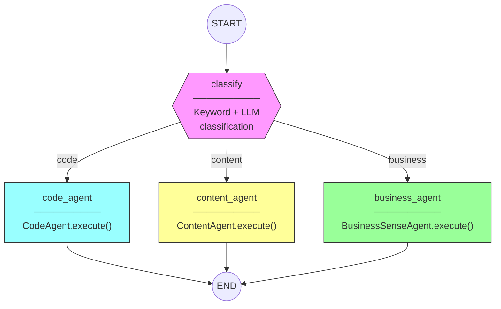
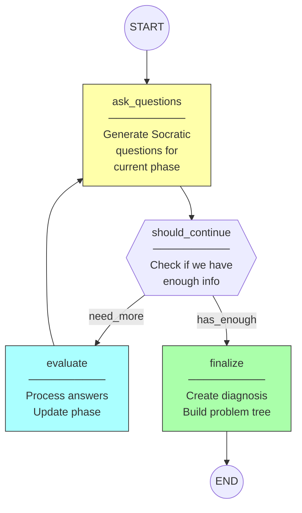
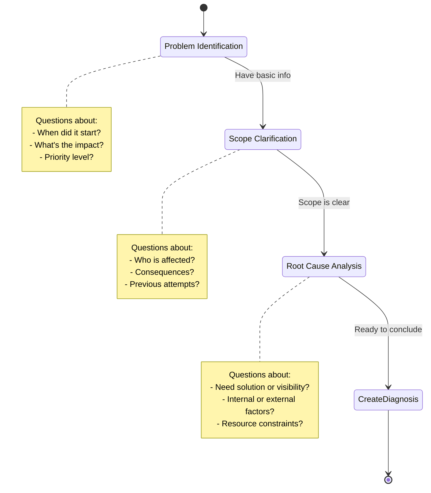

# LangGraph Deep Dive

This document explains how LangGraph is used in PeerAgent for agent orchestration and stateful workflows.

## What is LangGraph?

LangGraph is a library for building stateful, multi-actor applications with LLMs. It provides:

- **State Management**: Track conversation context across multiple steps
- **Conditional Routing**: Dynamic decision-making based on state
- **Graph-based Workflows**: Define complex agent interactions as nodes and edges

---

## PeerAgent LangGraph Implementation

### 1. PeerAgentState Definition

```python
class PeerAgentState(TypedDict):
    """State tracked throughout the workflow."""
    messages: Annotated[List[BaseMessage], operator.add]  # Accumulates messages
    task: str                                              # Original task
    session_id: Optional[str]                              # Session tracking
    task_id: Optional[str]                                 # Task tracking
    classified_type: Optional[str]                         # code/content/business
    agent_result: Optional[Dict[str, Any]]                 # Final result
    error: Optional[str]                                   # Error if any
```

### 2. Graph Structure



### 3. Building the Graph

```python
def _build_graph(self) -> StateGraph:
    # Create graph with state schema
    builder = StateGraph(PeerAgentState)
    
    # Add nodes (each node is an async function)
    builder.add_node("classify", classify)
    builder.add_node("code_agent", route_to_code)
    builder.add_node("content_agent", route_to_content)
    builder.add_node("business_agent", route_to_business)
    
    # Define flow
    builder.add_edge(START, "classify")
    
    # Conditional routing based on classification
    builder.add_conditional_edges(
        "classify",
        route_decision,  # Function that returns next node name
        {
            "code_agent": "code_agent",
            "content_agent": "content_agent",
            "business_agent": "business_agent"
        }
    )
    
    # All agents end the graph
    builder.add_edge("code_agent", END)
    builder.add_edge("content_agent", END)
    builder.add_edge("business_agent", END)
    
    return builder.compile()
```

---

## BusinessSenseAgent LangGraph (Socratic Dialogue)

The BusinessSenseAgent uses a more complex graph for multi-turn questioning.

### State Definition

```python
class BusinessAgentState(TypedDict):
    messages: Annotated[List[BaseMessage], operator.add]
    task: str                              # Original problem
    session_id: Optional[str]
    task_id: Optional[str]
    current_phase: Literal["identify", "clarify", "diagnose"]
    questions_asked: List[str]             # Track asked questions
    collected_answers: Dict[str, str]      # Answers received
    diagnosis: Optional[BusinessDiagnosis] # Final diagnosis
    iterations: int                        # Prevent infinite loops
```

### Workflow Graph



### Phase Transitions



---

## Key LangGraph Concepts Used

### 1. State Annotation for Message Accumulation

```python
messages: Annotated[List[BaseMessage], operator.add]
```

The `operator.add` annotation means new messages are **appended** to the list, keeping full conversation history.

### 2. Conditional Edges

```python
def route_decision(state: PeerAgentState) -> str:
    classification = state.get("classified_type", "content")
    return {
        "code": "code_agent",
        "content": "content_agent",
        "business": "business_agent"
    }.get(classification, "content_agent")
```

Returns the **name of the next node** to execute.

### 3. Node Functions

Each node is an async function that:
- Receives the current state
- Returns updates to the state

```python
async def classify(state: PeerAgentState) -> Dict[str, Any]:
    task = state["task"]
    classification = await self.classify_task(task)
    return {
        "classified_type": classification,
        "messages": [AIMessage(content=f"Classified as: {classification}")]
    }
```

### 4. Graph Compilation

```python
graph = builder.compile()
result = await graph.ainvoke(initial_state)
```

The compiled graph is invoked with initial state and returns final state.

---

## Visualization

You can visualize the graph structure:

```python
from IPython.display import Image, display

# Visualize the graph
display(Image(graph.get_graph().draw_mermaid_png()))
```

---

## Benefits of LangGraph Approach

| Benefit | Description |
|---------|-------------|
| **Modularity** | Each agent is a separate node, easy to add/remove |
| **State Persistence** | Conversation context maintained across steps |
| **Conditional Logic** | Dynamic routing based on classification |
| **Debugging** | Visual graph representation |
| **Scalability** | Can add complex multi-step workflows |
