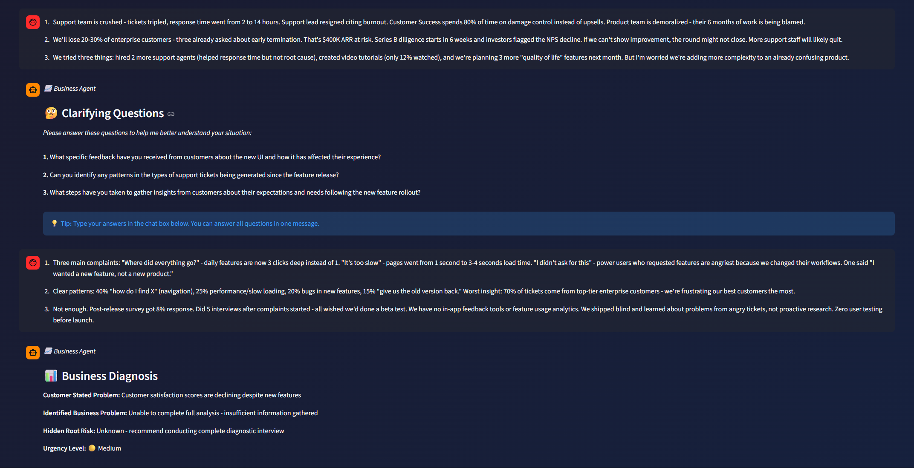
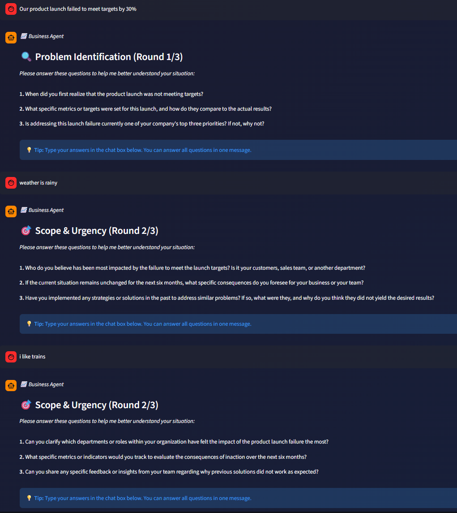

# LangGraph Deep Dive

> **How PeerAgent uses LangGraph for intelligent agent orchestration**

This document explains the LangGraph implementation in PeerAgent, including the Problem Tree generation, agent workflows, and alignment with the technical requirements.

---

## 📋 Table of Contents

1. [What is LangGraph?](#what-is-langgraph)
2. [Technical Requirements Overview](#technical-requirements-overview)
3. [System Architecture](#system-architecture)
4. [Agent Implementations](#agent-implementations)
   - [PeerAgent (Router)](#1-peeragent-router)
   - [BusinessSenseAgent](#2-businesssenseagent-socratic-dialogue)
   - [ProblemStructuringAgent](#3-problemstructuringagent-problem-tree)
   - [CodeAgent](#4-codeagent)
   - [ContentAgent](#5-contentagent)
5. [Graph Visualization](#graph-visualization)
6. [Key LangGraph Concepts](#key-langgraph-concepts)

---

## What is LangGraph?

LangGraph is a library for building stateful, multi-actor applications with LLMs. It provides:

| Feature | Description |
|---------|-------------|
| **State Management** | Track conversation context across multiple steps |
| **Conditional Routing** | Dynamic decision-making based on state |
| **Graph-based Workflows** | Define complex agent interactions as nodes and edges |
| **Persistence** | Save and restore state across sessions |

---

## Technical Requirements Overview

The system was built to fulfill the following requirements:

### Output 1: Business Sense Discovery Agent

| Requirement | Implementation |
|-------------|----------------|
| **Socratic Method** | 3-phase questioning flow (Identify → Clarify → Diagnose) |
| **Problem Definition Clarification** | "When did this start?", "What is the measurable impact?" |
| **Impact & Priority Testing** | "Is this a TOP 3 priority?", "What happens in 6 months?" |
| **Real Need vs Requested Solution** | "Do you need a solution or visibility first?" |
| **2-3 Questions Per Round** | Enforced in prompt: "Ask 2-3 focused questions at a time - never more" |

**Output Structure:**
```json
{
    "customer_stated_problem": "What the customer initially said",
    "identified_business_problem": "The actual underlying issue discovered",
    "hidden_root_risk": "Deeper systemic risk if not addressed",
    "urgency_level": "Low | Medium | Critical"
}
```

### Output 2: Problem Structuring Agent (Problem Tree)

| Requirement | Implementation |
|-------------|----------------|
| **Problem Classification** | 6 categories: Growth, Cost, Operational, Technology, Regulation, Organizational |
| **MECE Structure** | Mutually Exclusive, Collectively Exhaustive root causes |
| **Root Causes** | 3-5 major causes per problem |
| **Sub-Causes** | 2-3 specific factors under each root cause |

**Output Structure:**
```json
{
    "problem_type": "Growth | Cost | Operational | Technology | Regulation | Organizational",
    "main_problem": "Clear statement of the core issue",
    "root_causes": [
        {
            "cause": "Root cause description",
            "sub_causes": ["Sub-cause 1", "Sub-cause 2", "Sub-cause 3"]
        }
    ]
}
```

### Sub-Agents

| Requirement | Implementation |
|-------------|----------------|
| **ContentAgent** | Web search with DuckDuckGo, source citations |
| **CodeAgent** | Multi-language code generation (Python, SQL, Java, etc.) |
| **Modular Design** | Each agent is independent and pluggable |

---

## System Architecture

### High-Level Flow

```
┌─────────────────────────────────────────────────────────────────────────┐
│                              USER REQUEST                                │
│              "Our sales dropped 20% this quarter"                       │
└─────────────────────────────────────────────────────────────────────────┘
                                    │
                                    ▼
┌─────────────────────────────────────────────────────────────────────────┐
│                            PEERAGENT (ROUTER)                           │
│  ┌─────────────────────────────────────────────────────────────────┐   │
│  │  1. Keyword Classification (fast path)                          │   │
│  │  2. LLM Classification (fallback)                                │   │
│  │     → Classified as: BUSINESS                                    │   │
│  └─────────────────────────────────────────────────────────────────┘   │
└─────────────────────────────────────────────────────────────────────────┘
                                    │
         ┌──────────────────────────┼──────────────────────────┐
         ▼                          ▼                          ▼
┌─────────────────┐       ┌─────────────────┐       ┌─────────────────┐
│   CODE_AGENT    │       │ CONTENT_AGENT   │       │ BUSINESS_AGENT  │
│                 │       │                 │       │                 │
│ Multi-language  │       │ Web search +    │       │ Socratic        │
│ code generation │       │ citations       │       │ questioning     │
└─────────────────┘       └─────────────────┘       └────────┬────────┘
                                                             │
                                                             ▼
                                                    ┌─────────────────┐
                                                    │ PROBLEM_AGENT   │
                                                    │                 │
                                                    │ MECE Problem    │
                                                    │ Tree structure  │
                                                    └─────────────────┘
```

### LangGraph State Flow

```python
class PeerAgentState(TypedDict):
    """State tracked throughout the LangGraph workflow."""
    messages: Annotated[List[BaseMessage], operator.add]  # Accumulates messages
    task: str                                              # Original user task
    session_id: Optional[str]                              # Session tracking
    task_id: Optional[str]                                 # Task tracking
    classified_type: Optional[str]                         # code/content/business
    agent_result: Optional[Dict[str, Any]]                 # Final result
    error: Optional[str]                                   # Error if any
```

---

## Agent Implementations

### 1. PeerAgent (Router)

**Purpose:** Classify incoming tasks and route to the appropriate specialized agent.

**Graph Structure:**


**Implementation:**

```python
def _build_graph(self) -> StateGraph:
    builder = StateGraph(PeerAgentState)
    
    # Add nodes
    builder.add_node("classify", classify)
    builder.add_node("code_agent", route_to_code)
    builder.add_node("content_agent", route_to_content)
    builder.add_node("business_agent", route_to_business)
    
    # Entry point
    builder.add_edge(START, "classify")
    
    # Conditional routing based on classification
    builder.add_conditional_edges(
        "classify",
        route_decision,
        {
            "code_agent": "code_agent",
            "content_agent": "content_agent",
            "business_agent": "business_agent"
        }
    )
    
    # All agents terminate the graph
    builder.add_edge("code_agent", END)
    builder.add_edge("content_agent", END)
    builder.add_edge("business_agent", END)
    
    return builder.compile()
```

**Classification Logic:**

```python
# Two-tier classification for speed and accuracy
def classify_task(task: str) -> str:
    # 1. Fast keyword matching (no LLM call)
    keyword_result = _keyword_classify(task)
    if keyword_result:
        return keyword_result  # "code", "content", or "business"
    
    # 2. LLM classification (fallback)
    return await _llm_classify(task)
```

---

### 2. BusinessSenseAgent (Socratic Dialogue)

**Purpose:** Diagnose business problems through structured Socratic questioning.

**Requirements Fulfilled:**
- ✅ 3-phase questioning methodology
- ✅ 2-3 questions per round (not more)
- ✅ Answer validation before proceeding
- ✅ Final diagnosis with 4 required fields

**Workflow Graph:**

```
┌──────────────┐     ┌──────────────┐     ┌──────────────┐     ┌──────────────┐
│   IDENTIFY   │────▶│   CLARIFY    │────▶│   DIAGNOSE   │────▶│   COMPLETE   │
│   Phase 1    │     │   Phase 2    │     │   Phase 3    │     │  Diagnosis   │
└──────────────┘     └──────────────┘     └──────────────┘     └──────────────┘
       │                    │                    │                     │
       ▼                    ▼                    ▼                     ▼
  2-3 Questions       2-3 Questions       2-3 Questions        BusinessDiagnosis
       │                    │                    │                     +
       ▼                    ▼                    ▼               ProblemTree
  User Answer ─▶ Validate ─▶ If Valid, Next Phase
                    │
                    └─▶ If Invalid, Repeat with Feedback
```

**Phase Diagram:**


**State Definition:**

```python
class BusinessAgentState(TypedDict):
    messages: Annotated[List[BaseMessage], operator.add]
    task: str                                      # Original problem statement
    session_id: Optional[str]
    task_id: Optional[str]
    current_phase: Literal["identify", "clarify", "diagnose", "complete"]
    questions_asked: List[str]                     # Track asked questions
    collected_answers: Dict[str, str]              # Q&A history
    diagnosis: Optional[BusinessDiagnosis]         # Output 1
    problem_tree: Optional[ProblemTree]            # Output 2
```

**Answer Validation:**

```python
async def _validate_answers(task, questions, user_answer, phase) -> Dict:
    """
    Validates user answers before proceeding to next phase.
    Returns: {
        "valid": bool,
        "quality": "irrelevant" | "vague" | "partial" | "good",
        "can_proceed": bool,
        "feedback": str  # If not valid
    }
    """
```

---

### 3. ProblemStructuringAgent (Problem Tree)

**Purpose:** Convert business diagnosis into a structured MECE Problem Tree.

**Requirements Fulfilled:**
- ✅ Problem type classification (6 categories)
- ✅ 3-5 root causes per problem
- ✅ 2-3 sub-causes per root cause
- ✅ MECE (Mutually Exclusive, Collectively Exhaustive) structure

**How Problem Tree is Generated:**

```
┌─────────────────────────────────────────────────────────────────────────┐
│                      PROBLEM TREE GENERATION FLOW                        │
├─────────────────────────────────────────────────────────────────────────┤
│                                                                          │
│  1. Input: BusinessDiagnosis                                            │
│     ├─ customer_stated_problem                                          │
│     ├─ identified_business_problem                                      │
│     ├─ hidden_root_risk                                                 │
│     └─ urgency_level                                                    │
│                           │                                              │
│                           ▼                                              │
│  2. LLM Classification & Structuring                                    │
│     ├─ Classify into: Growth/Cost/Operational/Technology/etc.          │
│     ├─ Identify main problem statement                                  │
│     ├─ Generate 3-5 root causes                                         │
│     └─ For each cause, generate 2-3 sub-causes                         │
│                           │                                              │
│                           ▼                                              │
│  3. Output: ProblemTree                                                 │
│     {                                                                    │
│       "problem_type": "Growth",                                         │
│       "main_problem": "Revenue declining 20% YoY",                      │
│       "root_causes": [                                                  │
│         {"cause": "Market saturation", "sub_causes": [...]},           │
│         {"cause": "Pricing issues", "sub_causes": [...]},              │
│         {"cause": "Product quality", "sub_causes": [...]}              │
│       ]                                                                  │
│     }                                                                    │
└─────────────────────────────────────────────────────────────────────────┘
```

**Implementation:**

```python
class ProblemStructuringAgent(BaseAgent):
    """Agent specialized in structuring problems into MECE trees."""
    
    @property
    def system_prompt(self) -> str:
        return """You are an expert business analyst specializing in problem structuring.
        
        PROBLEM CLASSIFICATION:
        Classify into ONE of these categories:
        - Growth: Revenue, sales, market share, customer acquisition
        - Cost: Expense management, operational cost, efficiency
        - Operational: Process, workflow, delivery, quality
        - Technology: IT infrastructure, software, digital transformation
        - Regulation: Compliance, legal, regulatory
        - Organizational: HR, culture, structure, leadership
        
        PROBLEM TREE STRUCTURE:
        1. Main Problem: Clear, concise statement of the core issue
        2. Root Causes: 3-5 major causes contributing to the problem
        3. Sub-Causes: 2-3 specific factors under each root cause
        
        BEST PRACTICES:
        - Be MECE (Mutually Exclusive, Collectively Exhaustive)
        - Use actionable language
        - Focus on causes, not symptoms
        - Prioritize based on impact"""
    
    async def execute(self, diagnosis: BusinessDiagnosis) -> ProblemTree:
        """Generate a Problem Tree from BusinessDiagnosis."""
        messages = [
            SystemMessage(content=self.system_prompt),
            SystemMessage(content=self._get_json_format_prompt()),
            HumanMessage(content=f"Create a Problem Tree for:\n{diagnosis}")
        ]
        
        response = await self.llm.ainvoke(messages)
        return self._parse_to_problem_tree(response.content)
```

**Alternative Entry Point (Direct from Text):**

```python
async def structure_from_text(self, problem_description: str) -> ProblemTree:
    """Create Problem Tree directly from text without prior diagnosis.
    
    Useful for quick demonstrations or when full Socratic flow is not needed.
    """
```

---

### 4. CodeAgent

**Purpose:** Generate production-ready code in any programming language.

**Requirements Fulfilled:**
- ✅ Multi-language support (Python, SQL, Java, JavaScript, etc.)
- ✅ Language detection from user request
- ✅ Code explanations included
- ✅ Conversation context awareness

**Implementation:**

```python
class CodeAgent(BaseAgent):
    @property
    def system_prompt(self) -> str:
        return """You are an expert software engineer proficient in ALL languages.
        
        IMPORTANT: Generate code in the EXACT language requested.
        - If they ask for Java, write Java code
        - If they ask for SQL, write SQL code
        - If they ask for Python, write Python code
        
        Do NOT wrap code from other languages in Python.
        
        For each response:
        1. Identify the programming language requested
        2. Write clean, idiomatic code in THAT language
        3. Include proper syntax and conventions
        4. Provide a brief explanation"""
```

---

### 5. ContentAgent

**Purpose:** Research topics and provide information with source citations.

**Requirements Fulfilled:**
- ✅ Web search integration (DuckDuckGo)
- ✅ Source citations
- ✅ Structured research

**Implementation:**

```python
class ContentAgent(BaseAgent):
    def __init__(self):
        self.search_tool = DuckDuckGoSearchResults()
    
    @property
    def system_prompt(self) -> str:
        return """You are a research specialist.
        
        Provide accurate, well-structured information.
        Always cite sources when available.
        Pay attention to conversation history for context."""
```

---

## Graph Visualization

### Main PeerAgent Routing


### BusinessAgent Detailed Flow


### Example Success Case



### Example Validation Failure



---

## Key LangGraph Concepts

### 1. State Annotation for Message Accumulation

```python
messages: Annotated[List[BaseMessage], operator.add]
```

The `operator.add` annotation means new messages are **appended** to the list, preserving full conversation history.

### 2. Conditional Edges

```python
def route_decision(state: PeerAgentState) -> str:
    classification = state.get("classified_type", "content")
    return {
        "code": "code_agent",
        "content": "content_agent",
        "business": "business_agent"
    }.get(classification, "content_agent")
```

Returns the **name of the next node** to execute.

### 3. Node Functions

Each node is an async function that receives state and returns updates:

```python
async def classify(state: PeerAgentState) -> Dict[str, Any]:
    task = state["task"]
    classification = await self.classify_task(task)
    return {
        "classified_type": classification,
        "messages": [AIMessage(content=f"Classified as: {classification}")]
    }
```

### 4. Graph Compilation and Invocation

```python
graph = builder.compile()
result = await graph.ainvoke({
    "task": "Write a Python function",
    "messages": [],
    "session_id": "abc123"
})
```

---

## Benefits of LangGraph Approach

| Benefit | Description |
|---------|-------------|
| **Modularity** | Each agent is a separate node, easy to add/remove/modify |
| **State Persistence** | Conversation context maintained across steps |
| **Conditional Logic** | Dynamic routing based on classification result |
| **Debugging** | Visual graph representation for understanding flow |
| **Scalability** | Can add complex multi-step workflows easily |
| **Testability** | Each node can be tested independently |

---

## Summary

The PeerAgent system uses LangGraph to orchestrate multiple specialized agents:

1. **PeerAgent** routes tasks based on keyword/LLM classification
2. **BusinessSenseAgent** conducts Socratic diagnosis with 3 phases
3. **ProblemStructuringAgent** generates MECE Problem Trees
4. **CodeAgent** generates multi-language code
5. **ContentAgent** researches with citations

All agents follow the technical requirements:
- ✅ Output 1: 4-field Business Diagnosis
- ✅ Output 2: MECE Problem Tree with 3-5 causes
- ✅ Sub-agents: ContentAgent + CodeAgent
- ✅ Modular, extensible architecture

---

*Document updated: December 2024*
*Version: 2.0 - Added Problem Tree and PDF alignment*

