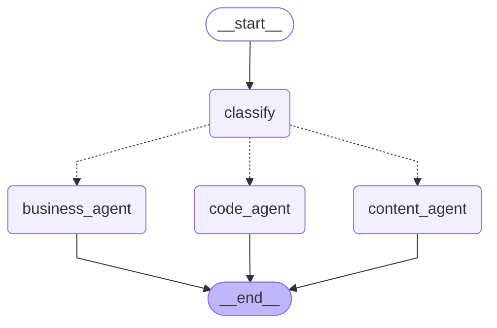

# PeerAgent LangGraph Workflow

```mermaid
---
config:
  flowchart:
    curve: linear
---
graph TD;
	__start__([<p>__start__</p>]):::first
	classify(classify)
	code_agent(code_agent)
	content_agent(content_agent)
	business_agent(business_agent)
	__end__([<p>__end__</p>]):::last
	__start__ --> classify;
	classify -.-> business_agent;
	classify -.-> code_agent;
	classify -.-> content_agent;
	business_agent --> __end__;
	code_agent --> __end__;
	content_agent --> __end__;
	classDef default fill:#f2f0ff,line-height:1.2
	classDef first fill-opacity:0
	classDef last fill:#bfb6fc

```
